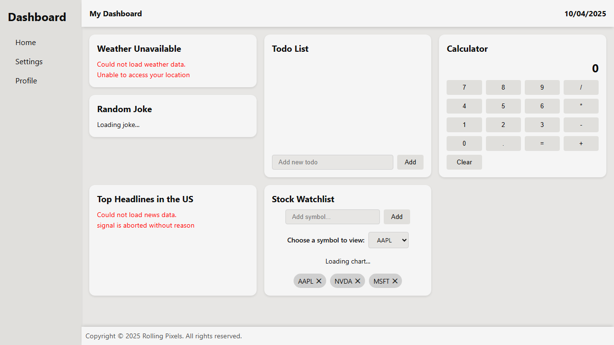

# React Dashboard

A customizable dashboard built with **React** and **SCSS modules**.
It includes a collection of interactive cards (weather, calculator, todos, jokes, etc.) with a responsive layout and theming support.

## Features

- **Reusable Card System:** all dashboard widgets use a shared `<Card />` component for styling.
- **Weather Card:** fetches live weather data using [OpenWeather API](https://openweathermap.org/api).
- **Todo Card:** add, remove, and mark tasks as complete — automatically saved in LocalStorage.
- **Calculator Card:** simple math calculator.
- **Joke Card:** fetches random jokes from [JokeAPI](https://jokeapi.dev/).
- **Stock Tracker Card:** displays live stock data from [Financial Modeling Prep](https://site.financialmodelingprep.com/).
- **News Feed:** fetches top headlines via [NewsAPI](https://newsapi.org/).
- **Theme Toggle:** allows switching between multiple visual themes.
- **Responsive Layout:** adaptive sidebar, sticky header/footer, and grid/flexbox handling.
- **CI/CD:** GitHub Actions pipeline for linting, testing, building, and deploying to Netlify.
- **Automated Screenshots:** Playwright test captures dashboard images for documentation.

## Screenshots / Demo

### Dashboard Layout



### Live Demo

[https://dillon-personal-dashboard.netlify.app/](https://dillon-personal-dashboard.netlify.app/)

## Tech Stack

- **Front End:** [React](https://react.dev/), [ReactIcons](https://github.com/react-icons/react-icons), [Vite](https://vite.dev/)
- **Styling:** [SCSS Modules](https://sass-lang.com/), CSS Variables
- **Documentation:** [Playwright](https://playwright.dev/) for automated UI screenshots
- **Linting & Formatting:** [ESLint](https://eslint.org/), [Prettier](https://prettier.io/)
- **CI/CD:** GitHub Actions, [Netlify](https://www.netlify.com/)
- **APIs:** [OpenWeather API](https://openweathermap.org/api), [NewsAPI](https://newsapi.org/), [JokeAPI](https://jokeapi.dev/), [Financial Modeling Prep](https://site.financialmodelingprep.com/)
- **API Integration:** Serverless functions on Netlify handle requests to third-party APIs securely:
    - **Weather:** OpenWeather API via `netlify/functions/weather.js`
    - **Stocks:** Financial Modeling Prep API via `netlify/functions/stocks.js`
    - **News:** NewsAPI via `netlify/functions/news.js`

## Getting Started

Clone the repo and run locally:

```bash
# Clone the repository
git clone https://github.com/dtb1996/personal-dashboard.git

# Navigate to the project folder
cd personal-dashboard

# Install dependencies
npm install

# Run development server
npm run dev
```

## Project Structure

```bash
src/
├── components/      # Reusable UI components (Card, Header, etc.)
├── context/         # Settings context setup
├── pages/           # Main site pages (Dashboard, Settings, Profile)
│	└── Dashboard    # Cards found on the Dashboard
├── styles/          # Global styles
├── utils/           # Utility functions (weatherAPI.js, calculator.js)
└── App.jsx/         # Main app layout
```

## Contributing

1. Fork the repo
2. Create your feature branch (`git checkout -b feature/your-feature`)
3. Commit changes (`git commit -m "Add feature"`)
4. Push to the branch (`git push origin feature/your-feature`)
5. Open a Pull Request

## License

MIT © 2025 Rolling Pixels
